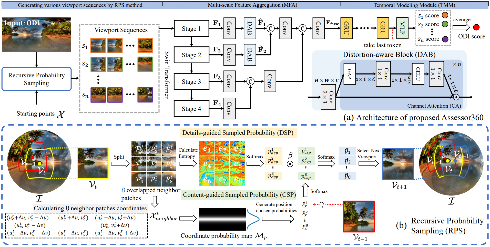

# Assessor360: Multi-sequence Network for Blind Omnidirectional Image Quality Assessment

Tianhe Wu*, Shuwei Shi*, Haoming Cai, Mingdeng Cao, Jing Xiao, Yinqiang Zheng and Yujiu Yang

[Tsinghua University Intelligent Interaction Group](https://sites.google.com/view/iigroup-thu/home)

:rocket:  :rocket:  :rocket: **Updates:**
- ✅ **June. 7, 2023**: We release the Assessor360 source code.

[](https://arxiv.org/abs/2305.10983)
[](https://github.com/TianheWu/Assessor360/releases)
[](https://github.com/TianheWu/Assessor360/issues)
[](https://github.com/TianheWu/Assessor360/issues)

[](https://github.com/IIGROUP)
[](https://github.com/TianheWu/Assessor360)


This repository is the official PyTorch implementation of Assessor360: Multi-sequence Network for Blind Omnidirectional Image Quality Assessment. :fire::fire::fire: We process all 2D VR IQA dataset MOS files, which can be seen in data folder. If you want to train your model, you can just download the dataset and modify the file in models and data folders. 

Click to see different distorted level omnidirectional images. You can also download [Insta360 Player](https://www.insta360.com/cn/download) to have a immersive experience.

|Ground Truth|Distortion 1|Distortion 2|Distortion 3|Distortion 4|
|       :---:       |     :---:        |        :-----:         |        :-----:         |        :-----:         | 
| |||||
|**MOS (GT)**|**3.45 (1)**|**2.95 (2)**|**1.6 (3)**|**1.1 (4)**|
|**Ours (Assessor360)**|**0.5933 (1)**|**0.5213 (2)**|**0.1220 (3)**|**0.0120 (4)**|
| |||||
|**MOS (GT)**|**4.85 (1)**|**3.25 (2)**|**2.4 (3)**|**1.3 (4)**|
|**Ours (Assessor360)**|**0.9566 (1)**|**0.7263 (2)**|**0.3495 (3)**|**0.0748 (4)**|
| |||||
|**MOS (GT)**|**4.35 (1)**|**3.35 (2)**|**2.6 (3)**|**1.3 (4)**|
|**Ours (Assessor360)**|**0.8194 (1)**|**0.5481 (2)**|**0.3583 (3)**|**0.1165 (4)**|

---

> *Blind Omnidirectional Image Quality Assessment (BOIQA) aims to objectively assess the human perceptual quality of omnidirectional images (ODIs) without relying on pristine-quality image information. It is becoming more significant with the increasing advancement of virtual reality (VR) technology. However, the quality assessment of ODIs is severely hampered by the fact that the existing BOIQA pipeline lacks the modeling of the observer's browsing process. To tackle this issue, we propose a novel multi-sequence network for BOIQA called Assessor360, which is derived from the realistic multi-assessor ODI quality assessment procedure. Specifically, we propose a generalized Recursive Probability Sampling (RPS) method for the BOIQA task, combining content and detailed information to generate multiple pseudo viewport sequences from a given starting point. Additionally, we design a Multi-scale Feature Aggregation (MFA) module with Distortion-aware Block (DAB) to fuse distorted and semantic features of each viewport. We also devise TMM to learn the viewport transition in the temporal domain. Extensive experimental results demonstrate that Assessor360 outperforms state-of-the-art methods on multiple OIQA datasets.* 
---

## Network Architecture


## Dataset
We test our model performance in [CVIQD](https://github.com/sunwei925/CVIQDatabase), OIQA, MVAQD, [IQA-ODI](https://github.com/yanglixiaoshen/SAP-Net) four 2D VR IQA datasets.

You can send emails to OIQA and MVAQD dataset authors to obtain datasets.

## Checkpoints for Assessor360

Click into the website and download the pretrained model checkpoints.
| Training Set | Testing Set|        Checkpoints     | 
| :---:        |     :---:      |:---:      |
|[CVIQD](https://github.com/sunwei925/CVIQDatabase) dataset (16 reference images, 429 distorted images for training) | [CVIQD](https://github.com/sunwei925/CVIQDatabase) dataset (99 distorted images for testing) | |
| OIQA dataset (16 reference images, 260 distorted images for training) | OIQA dataset (60 distorted images for testing) | |
| [IQA-ODI](https://github.com/yanglixiaoshen/SAP-Net) dataset (120 reference images, 768 distorted images for training) | [IQA-ODI](https://github.com/yanglixiaoshen/SAP-Net) dataset (192 distorted images for testing) | |
| MVAQD dataset (15 reference images, 240 distorted images for training) | OIQA dataset (60 distorted images for testing) | |


## Usage
### Training Assessor360
- Modify "dataset_name" to choose which datasets you want to tran in config
- Modify training and validation dataset path
model_name and type_name is the file path for saving checkpoint and log file
```
python train_oiqa.py
```
### Predicting one ODI quality score
- Modify the path of image "image_path"
- Modify the path of checkpoint "model_weight_path"
```
python inference_one_image.py 
```


## Citation
```
@article{wu2023assessor360,
  title={Assessor360: Multi-sequence Network for Blind Omnidirectional Image Quality Assessment},
  author={Wu, Tianhe and Shi, Shuwei and Cai, Haoming and Cao, Mingdeng and Xiao, Jing and Zheng, Yinqiang and Yang, Yujiu},
  journal={arXiv preprint arXiv:2305.10983},
  year={2023}
}
```
